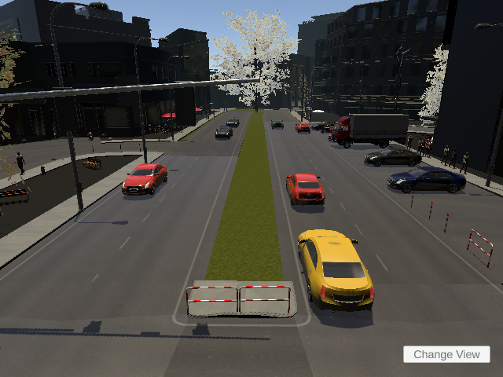
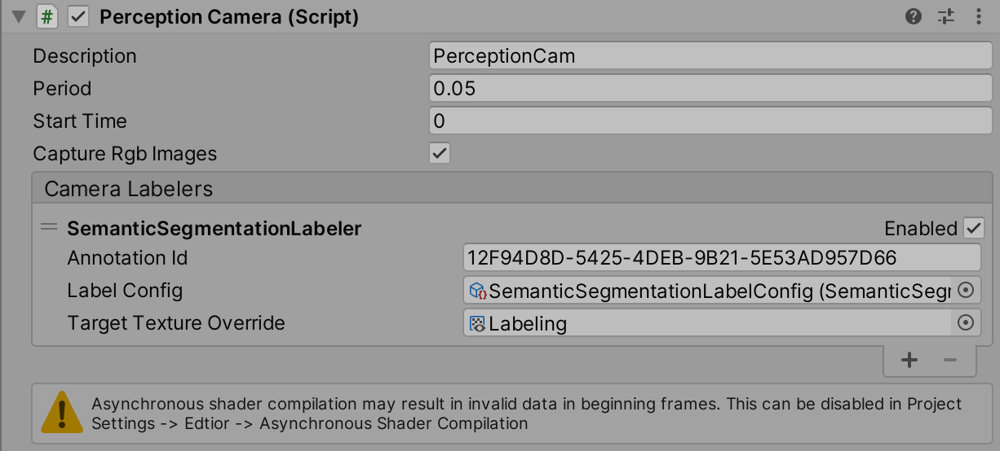
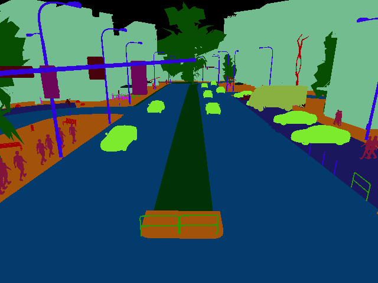
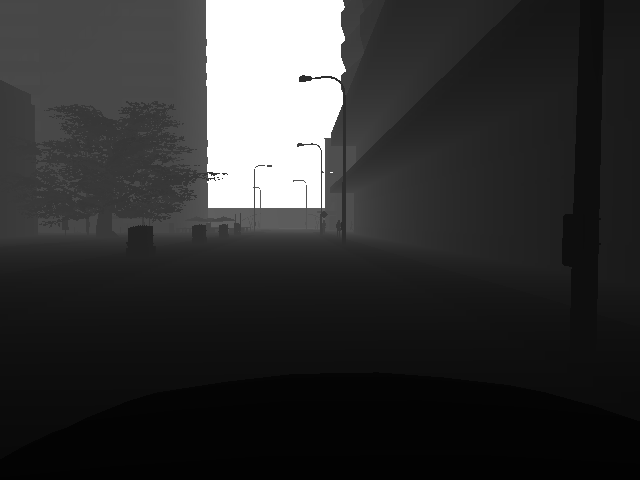

# Unity Simulation Sample Project

## Windridge 
#### Rendering Pipeline : Universal Rendering Pipeline

This sample project demonstrates the usage of Perception SDK for RGB images, Depth capture, Semantic segmentation and Data Logs and running it on USim at scale to generate dataset that can be used for training a machine learning model.

### About Project

Category : Smart Cameras

This project exemplifies a general way of capturing synthetic data for any simulation. This approach can be applied to any other usecase.
The scene setup comprises a predefined waypoint system for cars to drive around the city, a waypoint system for people to walk and other environment objects. There are two cameras setup one at the intersection to visualize the traffic and another one on the dashboard of one of the cars moving around the city.

### USimCaptureDemo
This is an empty gameobject in the hierarchy that is responsible for driving the simulation and applying labeling to the objects in the scene.

### Components

#### PerceptionCamera 
This component enables capture of RGB images, Semantic segmentation and Bouding box annotations for the source camera on which this script is added. In this case the PerceptionCamera script component is added to the intersection camera and the car dashboard camera. You can chose the view for which you want to generate the dataset by clicking on "Switch Camera" while running locally in editor or player and via Simulation AppParam (explained later) while running in the cloud.

#### DepthGrab
This component captures depth for the dashboard camera of one of the cars. This component is enabled when the dashboard camera is enabled.

#### Perf Measure
This component keeps track of the number of frames generated and provides an FPS measure at the end based on total wall time elapsed.

#### ApplyLabeling 
This component uses perception sdk APIs to add labeling to all the tagged game objects in the scene. It takes in following items as an input.
- Tags: List of tags I have in the scene. 
- Camera: Source camera on which the labeling configuration needs to be added
- LabelingConfig :  LabelingConfiguration scriptable object created from PerceptionSDK.

On switching to the car's dashboard camera view, the depth camera is enabled and you will see images with depth data getting saved at the same location. The depth is saved in the format selected from the dropdown (jpg in this case)

#### Running on USim
The project is created with OpenGL graphics API and so you will be able to run this in USim with CPU based rendering. You can follow the same process described here (add link) to build and run on USim.

## Run on USim from Editor
Unity Simulation Client package provide C# APIs to perform USim CLI workflow from the editor and improve iteration time. This project has a menu item which provides option to Build Project and Execute on USim

#### Parameterization
This is one of the important aspects of running the simulation to generate a variety of dataset.
The project is set up with a few SimulationOptions
- MaxNumberOfCars
- MaxNumberOfFramesToCapture
- EnableCapturingDrivingLogs
- EnableDepthCamera
- CameraViewToCapture
- TimeOfDay
- Light Intensity

You can set different appParams with these options and run the desired number of instances against each appParam. The simulation config is parsed on RuntimInitializeOnLoad and applied to the simulation configuration.

#### How to extend this project
This project can be extended to simulate smart cameras at a traffic intersection. The waypoint system and car physics can be modified to generate difference scenarios to generate data set.

### Limitations and known issues
Limitations
- The current waypoints system supports upto 20 cars. 
- The waypoint system is not configurable. 
- Car physics uses a single raycast to account for car in the front. It does not account for cars in the blind spot.

#### Known Issues
Depth grab currently does not work as expected with explicit render texture provided to camera's target texture. The work around for this is, provide a RenderTexture to Car's _RegularCam and set targetTexture of _DepthCam to None while running with Car dashboard camera view.
